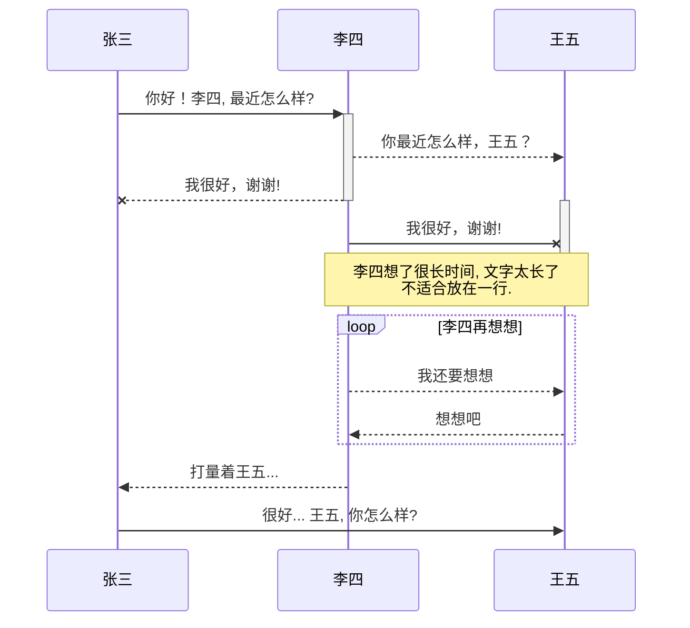

# Markdown学习指南

## 1. 标题与段落
### 1.1标题
要创建标题，请在单词或短语前面添加井号 (#) 。井号的数量代表了标题的级别。例如，添加三个井号即创建一个三级标题 (<h3>) (例如：### My Header)。

一级标题：`#+空格` 或者 `ctrl+1`

二级标题：`##+空格` 或者 `ctrl+2`

三级标题：`###+空格` 或者 `ctrl+3`

四级标题：`####+空格` 或者 `ctrl+4`

标题级别：`ctrl+=` 提升标题级别  `ctrl+-` 降低标题级别


### 1.2 段落
要创建段落，请使用空白行将一行或多行文本进行分隔。

### 1.3 换行--分割线

在一行的末尾添加**两个或多个空格，然后按回车键（return）**，即可创建一个换行（line break） (`<br>`)。

分割线：---;	`三个减号或者三个*号`

---


### 1.4 名言引用

> 世间哪得双全法，不负如来不负卿。
> 人生若只如初见，何事秋风悲画扇。等闲变却故人心，却道故人心易变。

### 1.5 代码显示

- 如果只有一段，不换行，可以用 ``语句包起来；
- 如果引用为多行，可以将`````加在代码段的首行和末行。`
- 快捷键：**ctrl+shift+`**  这是一个简易代码块
- 快捷键：`三个着重号+语言类型` 或者 `ctrl+shift+k` 代码插入代码块

`单行`

快捷键：`三个着重号+语言类型` 或者 `ctrl+shift+k` 代码插入代码块

```
多
行
```

## 2. 嵌入元素

### 2.1 超链接

快捷键：`中括号+小括号` 或者 Ctrl+K *(中括号中为超链接的文本说明，小括号中为链接地址)*

 [连接](http://www.baidu.com)

### 2.2 链接图片


快捷键：`感叹号+中括号+小括号` 或者 `Ctrl+shift+i` *（中括号中为图片说明，小括号中为链接）*

### 2.3 名言引用
> 世间哪得双全法，不负如来不负卿。
> 人生若只如初见，何事秋风悲画扇。等闲变却故人心，却道故人心易变。

### 2.4 表格

快捷键：`Ctrl+T`

| 左对齐 |      |      |      |      |
| :----: | ---- | ---- | ---- | ---- |
|        |      |      |      |      |

### 2.5 插入Latex公式

当你需要在编辑器中插入数学公式时，可以使用两个美元符 $$ 包裹 TeX 或 LaTeX 格式的数学公式。

**欧拉公式**
$$
e^{i\pi}+1=0
$$


## 3.字体强调
### 3.1粗体-斜体

文本加粗：`两边都用两个*号` 或者 `Ctrl+B` **Hello,world!**

文本斜体：`两边都用一个*号` 或者 `Ctrl+I`  *Hello,world!*

文本下划线：`Ctrl+u`   <u>Hello,world!</u>

文本删除线：`~~` ;  		或者 `Alt+Shift+5` ~~Hello,world!~~

文本加粗斜体：`***` ；	 ***Hello,world!\***


### 3.2 字体颜色

```
<font face="黑体">这就是黑体字</font>
<font face="微软雅黑">这是微软雅黑</font>
<font face="STCAIYUN">然后是华文彩云</font>
<font color=#0099ff size=7 face="黑体">color=#0099ff size=72 face="黑体"</font>
<font color=#00ffff size=72>color=#00ffff</font>
<font color=gray size=72>color=gray</font>

Size：规定文本的尺寸大小。可能的值：从 1 到 7 的数字。浏览器默认值是 3。
```

###　3.３特殊符号

Markdown 使用反斜杠 \ 插入语法中用到的特殊符号。在 Markdown 中，主要有以下几种特殊符号需要处理：

1. \ 反斜线
2. ` 反引号
3. \* 星号
4. _ 底线
5. {} 花括号
6. [] 方括号
7. () 括弧
8. \# 井字号
9. \+ 加号
10. \- 减号
11. . 英文句点
12. ! 惊叹号

###　3.４脚注
 描述[^１]
 在文末添加脚注：
[＾１]: 说明

## 4. 列表

### 4.1无需列表 -
要创建无序列表，请在每个列表项前面添加破折号 (-)、星号 (*) 或加号 (+) 。缩进一个或多个列表项可创建嵌套列表。

- aa

- bb

- cc

### 4.2 有序列表
要创建有序列表，请在每个列表项前添加数字并紧跟一个英文句点。数字不必按数学顺序排列，但是列表应当以数字 1 起始。
1. 首先
2. 其次

### 4.3 列表中段落
要在保留列表连续性的同时在列表中添加另一种元素，请将该元素缩进四个空格或一个制表符，如下例所示.
- a. 列表A
	列表中段
	
- b. 列表b

  ```
  sddg
  sge
  <!--注释-->
  ```
##　５.流程图


```mermaid
graph TB
A[Apple]-->B{Boy}
A---C(Cat)
B.->D((Dog))
C==喵==>D
style A fill:#2ff,fill-opacity:0.1,stroke:#faa,stroke-width:4px
style D stroke:#000,stroke-width:8px;
```



